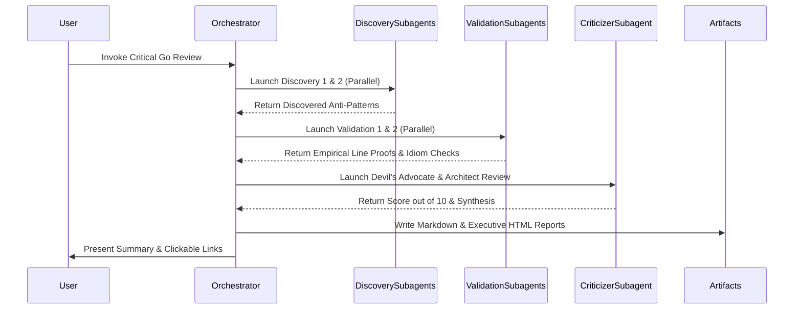

# Critical Golang Architecture Review & Multi-Agent Discovery Workflow

This skill defines a generic, project-agnostic multi-agent workflow, subagent roles, discovery prompts, validation checks, and reporting standards for conducting a deep, critical Golang codebase architecture review on any Go repository.

---

## 1. Overview & Multi-Agent Role Division

The review process utilizes **5 specialized subagents** operating across three distinct tracks:

```
                  ┌───────────────────────────────────────────────┐
                  │           Orchestrator Agent                  │
                  └───────────────────────┬───────────────────────┘
                                          │
       ┌──────────────────────────────────┼──────────────────────────────────┐
       │ Track A: Discovery               │ Track B: Validation              │ Track C: Criticism
       ▼                                  ▼                                  ▼
┌───────────────┐  ┌───────────────┐  ┌───────────────┐  ┌───────────────┐  ┌────────────────┐
│ Discovery 1   │  │ Discovery 2   │  │ Validation 1  │  │ Validation 2  │  │ Critical       │
│ (API/Errors)  │  │ (Engine/Mem)  │  │ (Empirical)   │  │ (Go Idioms)   │  │ Architect      │
└───────────────┘  └───────────────┘  └───────────────┘  └───────────────┘  └────────────────┘
```

| Role | Subagent Name | Responsibilities | Target Areas |
| :--- | :--- | :--- | :--- |
| **Track A: Discovery 1** | API & Ergonomics Discoverer | Audit public surface, options/request structs, reflection usage, error sentinels, and context propagation. | Public APIs, exported packages, configuration builders, error definitions |
| **Track A: Discovery 2** | Engine & Memory Discoverer | Audit mutex locking granularity, `sync.Pool` allocations, data structure copying, and algorithm complexity. | Internal core packages, engine modules, memory buffers, concurrency primitives |
| **Track B: Validation 1** | Empirical Validator | Verify discovered findings against actual line numbers, test suites (`go test`), race detectors (`go test -race`), and bounds checks. | Entire repository & test suite |
| **Track B: Validation 2** | Go Idioms Validator | Verify findings against Go stdlib design standards (`net/http`, `io`, `image`, `os`), package decoupling (DAG), and legacy port artifacts. | Entire repository |
| **Track C: Criticizer** | Lead Architect (Devil's Advocate) | Synthesize findings, evaluate production wins vs theoretical nitpicks, assign rating out of 10, detail Good vs Bad, and build 10/10 roadmap. | All findings & benchmarks |

---

## 2. Generic Subagent Prompt Templates

### Subagent Prompt 1: Discovery Agent 1 (API & Ergonomics)
```text
Perform a critical discovery audit of API Ergonomics, Package Boundaries, Error Types, and Settings/Config Architecture across the target Go codebase:
Files/Packages to inspect:
- Public API surfaces and entrypoint files
- Configuration, settings, and option builders
- CLI argument parsers and flag handlers
- Sentinel error packages and custom error types

Identify everything that is BAD or suboptimal about how Go is used:
1. Public API ergonomics (e.g. monolithic union structs vs sealed option interfaces, mutable exported structs, un-exported vs exported surface leaks).
2. Error handling (sentinel error consistency vs wrapcheck suppressions, loss of error context via %s instead of %w, inconsistent error prefixes).
3. Context propagation (handling nil context in internal functions, storing context in structs, redundant cancellation checks around CPU-bound code).
4. Configuration architecture (runtime string reflection vs strongly-typed option setters, package-level global mutable maps).

Return structured findings with file paths, line numbers, current code, flawed pattern explanation, and ideal Go idiomatic alternative.
```

### Subagent Prompt 2: Discovery Agent 2 (Engine & Memory)
```text
Perform a critical discovery audit of Engine Core, Memory Pools, Concurrency, and Data Layout across the target Go codebase:
Files/Packages to inspect:
- Core processing and conversion engine modules
- Layout, rendering, or data transformation pipelines
- Memory buffer pools, slice recycling, and caching layers
- Synchronization primitives (sync.Mutex, sync.RWMutex, channels, atomic operations)

Identify everything that is BAD or suboptimal in terms of Go performance, memory allocations, and concurrency:
1. Mutex locking granularity (e.g. coarse sync.RWMutex held across heavy CPU loops or disk I/O, lock contention risks, reader-writer starvation).
2. Memory pool mechanics (e.g. sync.Pool slice header heap escapes via &slice, useless pool getters where buffers aren't assigned to outputs, copy-on-put allocations).
3. Data ownership & heap allocations (deep copying AST/DOM/struct trees, slice reallocations in inner loops, per-iteration map allocations).
4. Large function complexity and nolint directive overuse (nolint suppressions hiding structural complexity, cyclop/funlen/gocognit bypasses).

Return structured findings with file paths, line numbers, current code, flawed pattern explanation, and ideal Go idiomatic alternative.
```

### Subagent Prompt 3: Validation Agent 1 (Empirical Codebase Validator)
```text
Validate the findings of Discovery Agents 1 & 2 against empirical codebase evidence:
Files/Packages to inspect:
- All source files across internal and public packages
- Benchmark files and unit test suites

Verify:
1. Are the discovered lock contention issues, memory allocations, or error handling flaws real and reproducible in code?
2. Test code paths and bounds checks: where do potential panics, race conditions, out-of-bounds indexing, or unhandled nil pointers still exist?
3. Benchmarks & Performance: does the current implementation actually achieve target performance, or are there hidden allocation spikes under heavy workloads?

Return a validated report ranking each finding by severity (Critical, High, Medium, Low), confirming or refuting discovery claims with line-level proof.
```

### Subagent Prompt 4: Validation Agent 2 (Go Idioms & Architecture Validator)
```text
Validate the findings of Discovery Agents 1 & 2 against Go idioms, stdlib design standards, and architecture best practices:
Files/Packages to inspect:
- Public API surfaces and internal package boundaries

Verify:
1. API Design: Is the codebase following standard Go library idioms (like net/http, os, image, io, slog)?
2. Package decoupling: Are internal packages cleanly isolated without circular dependencies or leaky reverse dependencies?
3. Idiomatic Go vs legacy port heritage: Where is C/C++/Java style (like manual pool pointer tricks, C-style flags, heavy struct passing, string-key dispatch) leaking into Go code?

Return a validated idiomatic Go assessment report.
```

### Subagent Prompt 5: Critical Architect & Reviewer (Devil's Advocate)
```text
Act as the Lead Golang Architect & Critical Reviewer:
Your job is to synthesize all discovery and validation findings into a brutal, honest, and highly constructive Go architectural critique.

Determine:
1. Rating out of 10: Provide an overall numerical rating out of 10 for the current codebase state.
2. What is GOOD in the current project: Detail all solid engineering choices (e.g. zero CGO dependencies, standard library alignment, execution speed, test suite pass rate).
3. What is BAD in the current project: Detail all architectural debt, legacy porting artifacts, linter suppressions, lock contention, memory footprint issues, and API design flaws.
4. Critique of Findings (Devil's Advocate): Critically evaluate whether proposed refactorings are necessary production improvements or over-engineered theoretical nitpicks.
5. Actionable Roadmap to a True 10/10 Go Codebase.

Return your critique in structured markdown format ready for synthesis.
```

---

## 3. Report Output Requirements

Upon completion of the subagent review wave, the orchestrator generates **two artifact reports** stored in the destination target folder:

1. **Markdown Report (`critical-golang-architecture-review.md`)**:
   - Overall score out of 10 with weighted assessment matrix.
   - Comprehensive "What is GOOD" vs "What is BAD" analysis.
   - Detailed findings with file paths, line numbers, flawed code snippets, and 10/10 idiomatic solutions.
   - Subagent validation matrix & Devil's Advocate evaluation.
   - Actionable 5-phase 10/10 refactoring roadmap.

2. **Interactive HTML Presentation (`executive-summary-critical-review.html`)**:
   - Modern HSL dark theme with Outfit & Inter typography.
   - Header with visual score pill badge (e.g., `8.4 / 10`) and benchmark comparison metrics.
   - Interactive tabbed navigation: Executive Scorecard, Good vs Bad Breakdown, 5 Subagent Audit & Validation, Devil's Advocate Critique, 10/10 Actionable Roadmap.
   - Code diff comparison snippets (`code-bad` vs `code-good`).
   - Self-contained HTML with zero external JS framework dependencies.

---

## 4. Execution Workflow Summary


